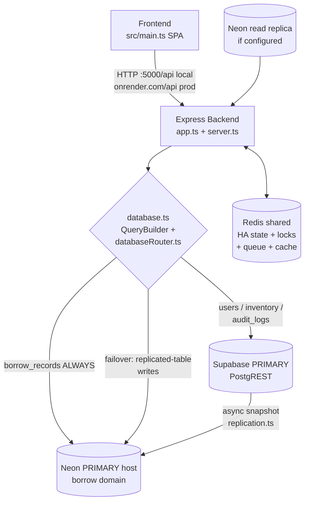
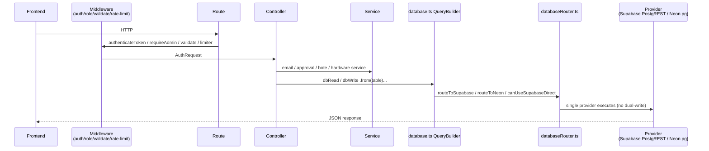
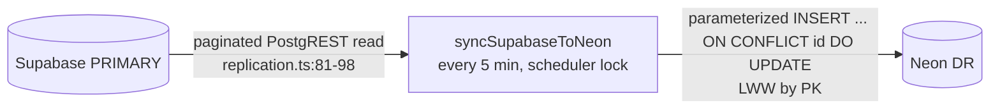
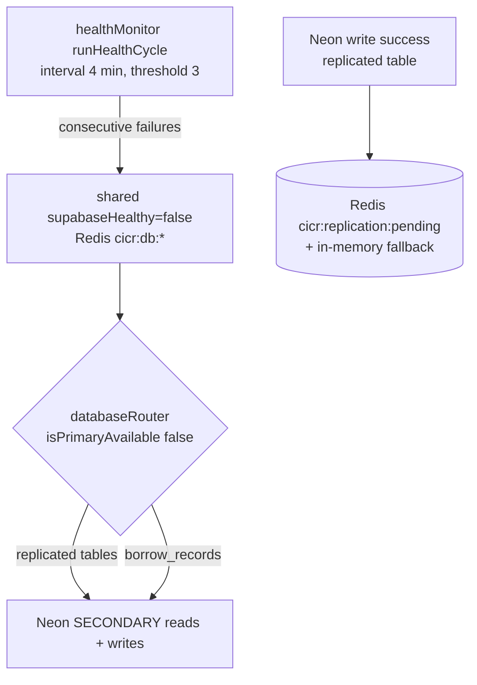
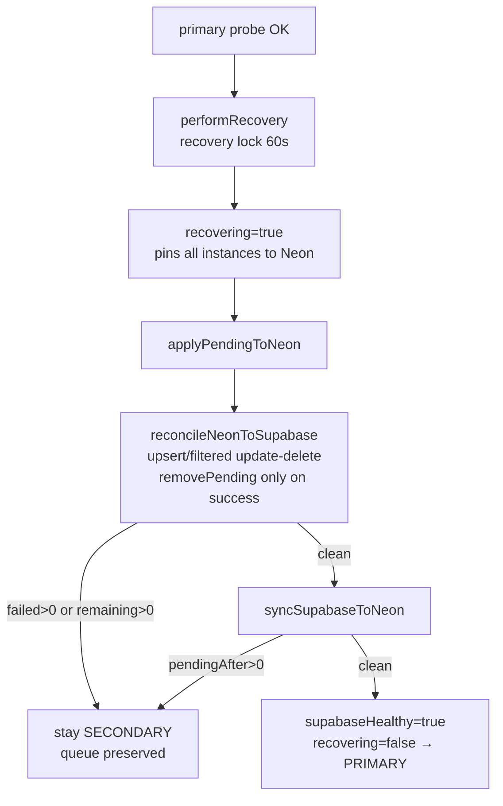
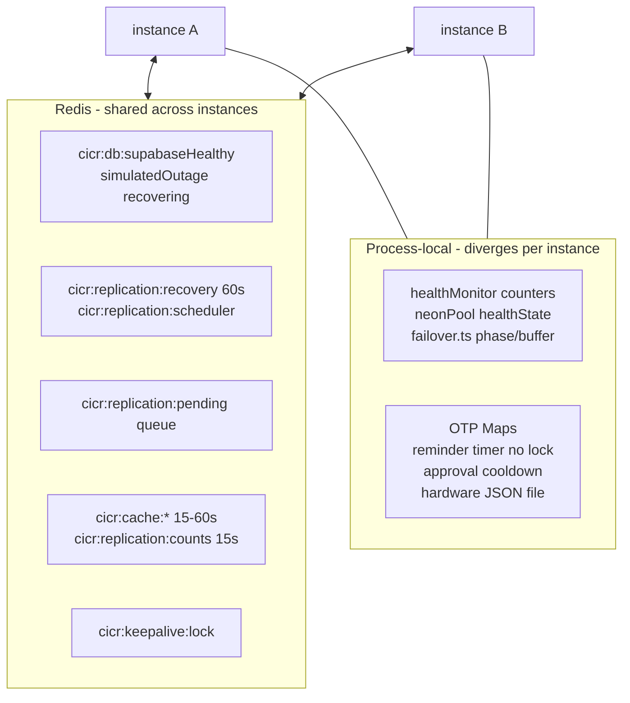

# CICR Inventory — Final System Pipeline, Architecture & Integration Audit

> Branch: `cicr-final-integration` (in-progress merge — report is uncommitted draft).
> Date (UTC): 2026-09-15. Upstream fetched with `git fetch upstream --prune` in this session.
> Engineering audit, not marketing copy. No test is claimed passing unless run in this session — **no tests were run in this session**.

## 1. Executive Summary

- `upstream/main` is at **`e39d05e`** and is **NOT contained** in the integration branch. Baseline merge-base is **`76a117c`**. Three owner commits since baseline (`cf03fdf`, `458bf8a`, `e39d05e`) are **absent** from `HEAD=da1b791 + MERGE_HEAD=7888537` (verified: `git merge-base --is-ancestor e39d05e HEAD` = false, same for `MERGE_HEAD`).
- The in-progress merge combines the latency tip (`da1b791`, 2 files) with HA work (`8be6047` + `7888537`, ~41 staged files). It does **not** include any of the 14 upstream-new files' new content.
- 7 files need 3-way merges (6 staged overlaps + 1 unstaged): `emailQueue.ts`, `redis.ts`, `auth.controller.ts`, `authOtpController.ts`, `borrow.controller.ts`, `hardwareRequestService.ts`, `emailService.ts`. `borrow.routes.ts` (upstream return-request route) has **no local counterpart** and applies cleanly — but is currently missing.
- Verified working architecture: Express → `database.ts QueryBuilder` → `databaseRouter.ts` → Supabase PRIMARY (PostgREST) for `users/inventory/audit_logs`, **Neon-always for `borrow_records`**, **asynchronous snapshot replication** Supabase→Neon (`replication.ts`), Redis shared HA state + pending queue. This is **not** synchronous replication; RPO is **not** zero.
- **43 backend endpoints** inventoried from route files (no invented endpoints). Real gaps with code evidence: (1) `POST /api/borrow/requests/:id/approve|reject` + `GET /api/borrow/requests` lack `requireAdmin`; (2) open `app.use(cors())` after the allowlist (`app.ts:47`) negates the CORS allowlist; (3) `POST /api/auth/reset-password` has no auth/OTP/rate-limit; (4) unauthenticated `GET /api/smtp-debug` leaks SMTP presence.
- **PR readiness: NOT READY.** Blockers listed in §20 (upstream integration missing + in-progress merge unresolved + HIGH security gaps + failover coverage holes for `borrow_records` / `hardware_requests` JSON queue).

## 2. Current Source Baseline

| Ref | Commit | Content |
|---|---|---|
| `upstream/main` (fetched this session) | `e39d05e2db23115b2396c668cc5e50a3444101fc` | `feat: return all issued items to inventory and implement dynamic reserve stock badge rules` |
| Integration branch | `cicr-final-integration`, `HEAD = da1b791175f3995ad138a0703296adffc8a9a8ed`, `MERGE_HEAD = 78885370b3ab125a726793153b28b56966eb4418` | In-progress merge, all conflicts fixed, uncommitted (plus 1 unstaged file) |
| Baseline (merge-base HEAD↔upstream/main) | `76a117c2952a7e3d93ecbcf436a513036fda67b9` | `fix(auth): wire sidebar reset password key to modal with database credential sync` |
| Latency commit | `da1b791` `perf: optimize dashboard and system metrics latency` | Touches only `backend/src/modules/dashboard/dashboard.controller.ts` + `backend/src/modules/system/system.controller.ts` (58+/27−) |
| HA commits | `8be6047` `feat: add database HA failover and replication` (~25 files, +2720/−171) + `7888537` `fix: resolve HA rebase conflicts` (`app.ts`, `database.ts`) | Router, health, replication, failover, pools, Redis locks, keepalive, idempotency, HA tests, migration `006`, config |
| Upstream-new (after baseline, absent locally) | `cf03fdf` (12 files), `458bf8a` (2 files), `e39d05e` (4 files) | See classification below |

### 2.1 Upstream-new classification (per-file)

Baseline diff: `git diff --name-only 76a117c..e39d05e` = 14 files. Overlap with HA-staged (`git diff --cached --name-only`, 41 files): 6 files. Plus 1 unstaged overlap (`auth.controller.ts`, typing-only `AuthUserRow` hunk). Latency tip has **zero file overlap** with upstream-new. `MERGE_HEAD` touches only `app.ts`/`database.ts` — no overlap with upstream-new.

**`cf03fdf` — login security alerts without OTP, admin broadcast emails, current-password verification, aesthetic reset modal:**

| File | Classification |
|---|---|
| `config/emailQueue.ts` (+TLS rediss) | conflicts-with-HA (HA rewrote SMTP creds to getters; keep both) |
| `config/redis.ts` (+TLS) | conflicts-with-HA (HA added `normalizeRedisUrl` + locks; same block) |
| `modules/auth/auth.controller.ts` (login-alert trim, resetPassword overhaul: drop username lookup, master aliases + approvals fallback, require current_password, password-changed mail) | must-be-incorporated / dangerous-regression-prone (auth-security; overlaps only unstaged typing hunk) |
| `modules/auth/authOtpController.ts` (stub strip) | conflicts-with-HA (same file touched; likely same intent — verify by 3-way) |
| `modules/borrow/borrow.controller.ts` (`dbWrite` import, `submitReturnRequestHandler`, member→return-request routing, partial-return quantities, member history `or()` filter, reject passthrough) | conflicts-with-HA (HA routing hunk vs return-workflow hunk; keep both) |
| `modules/borrow/borrow.routes.ts` (+return-request route) | must-be-incorporated (no local overlap; **currently missing**) |
| `modules/borrow/hardwareRequestService.ts` (+393) | conflicts-with-HA (HA has hunk in same file) |
| `services/emailService.ts` (+505) | conflicts-with-HA (HA SMTP-getter hunk must survive) |
| `index.html`, `src/main.ts`, `src/style.css`, `src/types.ts` (reset modal) | must-be-incorporated / unrelated-to-HA (no HA/latency overlap; keep with `e39d05e` frontend) |

**`458bf8a` — email deliverability (BullMQ split connections, spam-header removal, DKIM message-id):**

| File | Classification |
|---|---|
| `config/emailQueue.ts` (split Queue/Worker Redis conns, pooled worker transporter, concurrency 5→3, SMTP pass whitespace strip, `tls.rejectUnauthorized:false`) | conflicts-with-HA / must-be-incorporated (preserve HA getters AND upstream pooling) |
| `services/emailService.ts` (drop `X-Auto-Response-Suppress`/`Auto-Submitted`/`List-Unsubscribe`, `generateMessageId→undefined` for DKIM, BCC admin on login alert) | conflicts-with-HA / dangerous-regression-prone (dropping = spam/quarantine regression) |

**`e39d05e` — return-all-to-inventory + dynamic reserve badge:**

| File | Classification |
|---|---|
| `backend/hardware_requests_data.json`, `backend/user_approval_data.json` | unrelated / dangerous-regression-prone (data files — decide local vs upstream state explicitly, do not blind-overwrite) |
| `index.html` (tooltip ≤2→≤50%), `src/main.ts` (new `getItemStockStatus`, Available/Low-Reserve-≤50% replacing Ask-in-Person/≤2) | must-be-incorporated / unrelated-to-HA (clean apply; keep with `cf03fdf` CSS since `status-ask-person` removal depends on it) |

Nothing classified `already-present` (ancestor check proves absence) or `conflicts-with-latency` (no file overlap with `da1b791`).

### 2.2 Integration status

- `git status`: in-progress merge, all conflicts fixed, staged but uncommitted (41 files) + 1 unstaged (`backend/src/modules/auth/auth.controller.ts`, typing-only).
- Forbidden actions respected: no commit/abort/reset/rebase/push/PR in this session (read-only git + this uncommitted docs report only).

## 3. Final Architecture

### 3.1 Frontend/backend/database (verified)

Normal request path:

Replication path (async snapshot):

Failover path:

Recovery path:

Redis coordination + horizontal scaling:

## 4. Complete Request/Data Pipeline

Universal pipeline (verified in code):

`Frontend component (src/main.ts)` → `fetch(API_BASE + path)` → `Express route (modules/*/*.routes.ts, app.ts, server.ts-mounted system.routes.ts)` → `middleware: authenticateToken / requireAdmin / validate(zod) / rateLimit` → `controller (*.controller.ts)` → `service/query layer (emailService, hardwareRequestService, auditService, boteService, userApprovalService)` → `database abstraction: dbRead/dbWrite (database.ts QueryBuilder)` → `router decision (databaseRouter.ts)` → `actual provider: supabaseQuery (PostgREST) | neonQueryWrite (Neon primary host) | neonQueryRead (replica else primary)` → `JSON response` (+ side-effects: email, audit row, Redis cache/queue).

Per-endpoint detail: see §5 matrix. Frontend→endpoint mapping (§5.2) derived from `src/main.ts` API calls.

## 5. Complete Endpoint Matrix

Totals: **43 endpoints** — Auth 16, Inventory 6, Borrow/Returns 10 (incl. 4 hardware-queue), Dashboard 2, System/HA+BOTE 7, Health/Debug 2. Mount prefixes: `app.ts:50-53` (`/api/auth`, `/api/items`, `/api/borrow`, `/api`), `server.ts:19` (`/api/system`), direct `app.get` (`app.ts:56,70`).

Columns: Method | Endpoint | Auth | Role | Controller | Service | Tables | DB | Redis | Failover | Replication | Notes. (R/W = read/write operation type.)

### 5.1 Authentication + users/admin (`/api/auth`)

| Method | Endpoint | Auth | Role | Controller | Service | Tables | DB | Redis | Failover | Repl. | Notes |
|---|---|---|---|---|---|---|---|---|---|---|---|
| POST | `/api/auth/register` | — | — | `auth.controller.ts:46 register` | approval, email, audit | users R+W, audit_logs W | Supabase (users) | — | users yes | users yes | registerLimiter+zod; W |
| POST | `/api/auth/login` | — | — | `auth.controller.ts:198 login` | login-alert email | users R(+W auto-promote `:288`), audit_logs W | Supabase | — | users yes | users yes | authLimiter+zod; R+W |
| POST | `/api/auth/verify-login-otp` | — | — | `auth.controller.ts:383` stub 400 | — | — | — | — | — | — | decommissioned; R:— |
| POST | `/api/auth/resend-login-otp` | — | — | `auth.controller.ts:390` stub 400 | — | — | — | — | — | — | decommissioned |
| POST | `/api/auth/send-otp` | — | — | `authOtpController.ts:9` stub 400 | — | — | — | — | — | — | otpLimiter only |
| POST | `/api/auth/verify-otp` | — | — | `authOtpController.ts:17` stub 400 | — | — | — | — | — | — | decommissioned |
| GET | `/api/auth/profile` | token | any | `auth.controller.ts:397 getProfile` | — | users R | Supabase | — | yes | yes | R |
| POST | `/api/auth/forgot-password` | — | — | `auth.controller.ts:634` stub 200 direct_reset | — | — | — | — | — | — | no limiter/validator |
| POST | `/api/auth/reset-password` | — | — | `auth.controller.ts:645 resetPassword` | email | users R+W, audit_logs W | Supabase | — | yes | yes | **no auth/OTP/rate-limit (§15)**; R+W |
| POST | `/api/auth/change-password` | token | any | `auth.controller.ts:731 changePassword` | password-changed email | users R+W, audit_logs W | Supabase | — | yes | yes | R+W |
| GET | `/api/auth/admin/users` | token+admin | ADMIN | `auth.controller.ts:425 listUsersForAdmin` | approval sync | users R, audit_logs R | Supabase | — | yes | yes | adminLimiter; R |
| POST | `/api/auth/admin/users/create` | token+admin | ADMIN | `auth.controller.ts:796 adminCreateUser` | welcome email | users R+W, audit_logs W | Supabase | — | yes | yes | R+W |
| POST | `/api/auth/admin/users/:id/approve` | token+admin | ADMIN | `auth.controller.ts:469 approveUser` | approval emails | users R, audit_logs W | Supabase | — | yes | yes | R+W |
| POST | `/api/auth/admin/users/:id/reject` | token+admin | ADMIN | `auth.controller.ts:508 rejectUser` | rejection emails | users R, audit_logs W | Supabase | — | yes | yes | R+W |
| POST | `/api/auth/admin/users/:id/role` | token+admin | ADMIN | `auth.controller.ts:542 changeUserRole` | — | users R+W, audit_logs W | Supabase | — | yes | yes | R+W |
| DELETE | `/api/auth/admin/users/:id` | token+admin | ADMIN | `auth.controller.ts:578 deleteUser` | — | users R+W, borrow_records W (by user_id), audit_logs W | Supabase+Neon (cross-DB, no txn) | — | partial (borrow no queue) | users/audit yes | R+W |

### 5.2 Inventory (`/api/items`, `inventory.routes.ts:15-22`)

| Method | Endpoint | Auth | Role | Controller | Service | Tables | DB | Redis | Failover | Repl. | Notes |
|---|---|---|---|---|---|---|---|---|---|---|---|
| GET | `/api/items` | — | — | `inventory.controller.ts:27 getItems` | — | inventory R | Supabase/Neon by mode | list cache 30s | yes | yes | R; `ilike` filters |
| GET | `/api/items/categories` | — | — | `inventory.controller.ts:68 getCategories` | — | inventory R | Supabase/Neon | none (full scan each call) | yes | yes | R; static fallback |
| GET | `/api/items/:id` | — | — | `inventory.controller.ts:83 getItemById` | — | inventory R | Supabase/Neon | id cache 30s | yes | yes | R |
| POST | `/api/items` | token+admin | ADMIN | `inventory.controller.ts:108 createItem` | item-created email, audit | inventory W, audit_logs W | Supabase (fails over to Neon) | invalidate | yes | yes | W |
| PATCH | `/api/items/:id` | token+admin | ADMIN | `inventory.controller.ts:169 updateItem` | audit | inventory R+W, audit_logs W | Supabase/Neon | invalidate | yes | yes | R+W; adjusts available_quantity |
| DELETE | `/api/items/:id` | token+admin | ADMIN | `inventory.controller.ts:213 deleteItem` | item-deleted email, audit | inventory R+W, borrow_records W (by inventory_id), audit_logs W | Supabase+Neon cross-DB | invalidate | partial | inventory/audit yes | W; guarded delete race (§16) |

### 5.3 Borrowing/returns + hardware requests (`/api/borrow`, `borrow.routes.ts:18-27`)

| Method | Endpoint | Auth | Role | Controller | Service | Tables | DB | Redis | Failover | Repl. | Notes |
|---|---|---|---|---|---|---|---|---|---|---|---|
| GET | `/api/borrow/admins` | — | — | `borrow.controller.ts:139 getAdmins` | static directory | — | — | admins 60s | n/a | n/a | R static |
| POST | `/api/borrow` | token | any | `borrow.controller.ts:157 borrowItem→finalizeBorrow:55` | borrow emails | inventory R+W, borrow_records R+W, audit_logs W | Supabase+Neon cross-DB | invalidate history | partial | inventory/audit yes | R+W; conditional decrement |
| POST | `/api/borrow/return` | token | any | `borrow.controller.ts:247 returnItem` | return emails | borrow_records R+W, inventory R+W, audit_logs W | Neon+Supabase cross-DB | invalidate history | partial | inventory/audit yes | R+W; atomic BORROWED→RETURNED guard |
| GET | `/api/borrow/history` | token | any (ADMIN=all) | `borrow.controller.ts:344 getBorrowHistory` | — | borrow_records R, users R, inventory R | Neon + Supabase | history 15s | reads follow mode | n/a (borrow not replicated) | R; `?force=true` bypass |
| POST | `/api/borrow/request-otp` | token | any | stub 400 | — | — | — | — | — | — | decommissioned |
| POST | `/api/borrow/verify-otp` | token | any | stub 400 | — | — | — | — | — | — | decommissioned |
| POST | `/api/borrow/request` | token | any | `borrow.controller.ts:406→hardwareRequestService:64` | hardware alert email | inventory R, **JSON file** W, audit_logs W | file+Supabase | — | **no** (file local) | no | R+W; split-brain risk (§16) |
| GET | `/api/borrow/requests` | token | **any (missing requireAdmin)** | `borrow.controller.ts:463→hardwareRequestService:155` | — | file R, borrow_records R (PENDING), audit_logs R, inventory R | file+Neon+Supabase | — | no | no | R; HIGH finding (§15) |
| POST | `/api/borrow/requests/:id/approve` | token | **any (missing requireAdmin)** | `borrow.controller.ts:478→hardwareRequestService:273` + finalizeBorrow | borrow/approval emails | inventory R+W, borrow_records W, file W, audit_logs W | file+Neon+Supabase | invalidate history | no | partial | R+W; HIGH finding (§15) |
| POST | `/api/borrow/requests/:id/reject` | token | **any (missing requireAdmin)** | `borrow.controller.ts:510→hardwareRequestService:423` | — | borrow_records R+W, file W, audit_logs W | file+Neon+Supabase | — | no | partial | R+W; HIGH finding (§15) |

**Upstream-missing (not in this branch):** `POST /api/borrow/return-request` (`submitReturnRequestHandler`, `cf03fdf`) — member return-approval workflow absent; member returns execute direct-return path instead.

### 5.4 Dashboard / statistics (`/api/*`, `dashboard.routes.ts:7-8`)

| Method | Endpoint | Auth | Role | Controller | Service | Tables | DB | Redis | Failover | Repl. | Notes |
|---|---|---|---|---|---|---|---|---|---|---|---|
| GET | `/api/stats` | — | — | `dashboard.controller.ts:9 getDashboardStats` | — | inventory R, users R, borrow_records R | mixed per table | stats 15s | yes | replicated tables yes | R; Promise.all |
| GET | `/api/audit` | token | any | `dashboard.controller.ts:54 getAuditLogs` | — | audit_logs R (+users/inventory join) | Supabase/Neon | — | yes | yes | R; any authed user reads full log (§15); limit ≤250 |

### 5.5 System/HA + BOTE (`/api/system/*`, `server.ts:19`, `system.routes.ts:16-24`)

| Method | Endpoint | Auth | Role | Controller | Service | Tables | DB | Redis | Failover | Repl. | Notes |
|---|---|---|---|---|---|---|---|---|---|---|---|
| GET | `/api/system/bote-metrics` | — | — | `system.controller.ts:44 getBoteMetrics` | boteService snapshot | borrow_records R, users R, inventory R | mixed | inputs 15s | yes | n/a | R; Promise.all |
| GET | `/api/system/simulate-scale` | — | — | `system.controller.ts:89 getSimulateScale` | boteService.simulateScale | — (compute) | — | — | n/a | n/a | pure compute; validated params |
| GET | `/api/system/replication/status` | token+admin | ADMIN | `system.controller.ts:119` | replication.getReplicationStatus | meta (all replicated) | Supabase+Neon | counts 15s | n/a | n/a | R; secret-scrubbed |
| POST | `/api/system/replication/sync` | token+admin | ADMIN | `system.controller.ts:128` | replication.syncSupabaseToNeon | Supabase→Neon | both | scheduler lock | n/a | **is** replication | R+W |
| POST | `/api/system/replication/reconcile` | token+admin | ADMIN | `system.controller.ts:138` | applyPendingToNeon+reconcileNeonToSupabase (raw, no lock/flag) | Neon→Supabase | both | queue | n/a | **is** recovery | R+W; unsafe vs performRecovery (§16) |
| POST | `/api/system/failover/simulate` | token+admin | ADMIN | `system.controller.ts:152` | dbHealth.setSimulatedOutage | — (routing flag) | Redis | shared outage flag | triggers | n/a | state change |
| POST | `/api/system/failover/recover` | token+admin | ADMIN | `system.controller.ts:170` | failover.performRecovery+checkSupabaseHealth | both | both | recovery lock | resolves | **is** recovery | 503 if primary down, 409 if in-progress; R+W |

### 5.6 Other (`app.ts` direct)

| Method | Endpoint | Auth | Role | Controller | Tables | DB | Notes |
|---|---|---|---|---|---|---|---|
| GET | `/api/health` | — | — | `app.ts:56`→healthMonitor.buildHealthPayload | — | R | 200 healthy/degraded, 503 down |
| GET | `/api/smtp-debug` | — | — | `app.ts:70` inline (net.Socket TCP 587/465 + DNS) | — | R | **leaks SMTP_USER + smtp_pass_set, unauthenticated (§15)** |

### 5.7 Frontend mapping (`src/main.ts`)

`DatabaseManager.syncFromBackend` + 3s auto-sync → `GET /items`, `GET /borrow/history`, `GET /audit`; add-item modal → `POST /items`; borrow modal → `POST /borrow/request`; return button → `POST /borrow/return`; `AuthManager` → `GET /auth/profile`, `POST /auth/login|register`; `PasswordResetManager` → `POST /auth/reset-password`; `AdminManager` → `GET /auth/admin/users`, `GET /borrow/requests`, `GET /audit`, approve/reject hardware, approve/reject/role/delete user, `DELETE /items/:id`. No frontend caller for `PATCH /items/:id`, `GET /items/categories`, `POST /borrow`, `GET /borrow/admins`, `GET /api/stats`, `POST /auth/change-password`, `POST /auth/admin/users/create`, OTP stubs, `/api/system/*`, `/api/health`, `/api/smtp-debug`. Notifications/email are side-effects (no direct endpoint).

## 6. Database Routing Matrix

Source of truth: `backend/src/config/databaseRouter.ts` + `backend/src/config/database.ts:208-262` + `backend/src/config/neonPool.ts:188-205`.

| Table | Normal mode | Failover (`!isPrimaryAvailable()`) | Pending queue | Replicated |
|---|---|---|---|---|
| `users` | Supabase PostgREST | Neon (`routeToNeon`, `poolQuery`) | yes (row / updates+filters / filters) | yes |
| `inventory` | Supabase incl. atomic `update…gte(available_quantity)` (`borrow.controller.ts:73-81`) | Neon | yes | yes |
| `audit_logs` | Supabase (`auditService.ts:21`) | Neon | yes | yes |
| `borrow_records` | **Neon always** (NEON_ATOMIC_TABLES; explicitly excluded from replication/failover — multi-statement stock mutation PostgREST can't wrap in one transaction) | Neon (unchanged) | **no** | **no** |
| `hardware_requests` (table) | Supabase per router entry, but **no code queries it** — real queue is `backend/hardware_requests_data.json` + module state, merged with Neon PENDING + audit-log regex (`hardwareRequestService.ts:42,44-62,170-258`) | still Supabase (not in replicated set → never diverts; effectively errors) | no | no |
| all other tables | none at runtime (`auth_otps`/`items` only in `scripts/`) | — | — | — |

Verified confirmations:
- **No accidental dual-write**: exactly one DB per op (`database.ts:220,226-237`); failover writes execute once on Neon then enqueue — no second synchronous write.
- **No stale Supabase `borrow_records` mirror**: old mirror deliberately removed (`hardwareRequestService.ts:122-125` comment); borrow reads/writes are Neon-only.
- **Neon writes in normal mode: YES (by design, not accidental)** — all `borrow_records` traffic + snapshot `upsertRowsToNeon` writes Neon in normal mode. Consequence: Neon is primary for the borrow domain, and cross-domain ops (borrow/return/item-delete/user-delete) span two databases with **no distributed transaction**.
- **Non-replicated table silently failing over: `hardware_requests`** routes Supabase-only and is unused; the real JSON queue neither replicates nor fails over.
- **Endpoints bypassing router**: only infra layer by design (`replication.ts` direct `getSupabaseAdmin`/`queryRead`/`queryWrite`; health probes; `system.controller.ts:172` pre-check; `server.ts:75` startup). `auth.controller.ts:4 supabase` alias = `dbWrite` (`database.ts:741`), still routed. `hardwareRequestService` bypasses DB entirely (file).
- **Conditional inventory updates stay on one consistent path**: `canUseSupabaseDirect` allow-list (`eq,neq,gt,gte,lt,lte,in,ilike,is_null`) diverts exotic-filter updates to Neon (`databaseRouter.ts:77-93`).
- **Failover writes go to Neon secondary**: via `poolQuery` → `neonQueryWrite` (primary host).
- **Recovery never flips PRIMARY before reconciliation**: `performRecovery` sets `supabaseHealthy=true` only after pending→Neon, Neon→Supabase, Supabase→Neon, and empty-queue verification; failures stay SECONDARY with queue preserved.

## 7. Normal Operation

Frontend → Express → `dbRead`/`dbWrite` → router → Supabase PRIMARY for `users/inventory/audit_logs`; Neon for `borrow_records`; reads served through Redis caches (stats 15s, items 30s, history 15s, bote inputs 15s, admins 60s). Snapshot scheduler (`SYNC_INTERVAL_MS` default 300000, scheduler lock TTL = interval) keeps Neon DR converging. Health monitor probes on its own interval; all-green keeps `supabaseHealthy=true`, `simulatedOutage=false`, `recovering=false` → `isPrimaryAvailable()=true` → PRIMARY routing.

## 8. Replication Pipeline

**Asynchronous snapshot replication** (never synchronous; no zero-RPO claim): `syncSupabaseToNeon()` paginated PostgREST reads → parameterized `INSERT … ON CONFLICT(id) DO UPDATE` upserts into Neon, last-write-wins by PK, no multi-master merge (`replication.ts:1-12,81-98,118-166`). Delete propagation gated on `isPrimaryAvailable() && pending==0` so failover rows aren't deleted mid-recovery (`:281,289-291`). Default interval 5 min; counts cache 15s avoids `COUNT(*)` per status call. `borrow_records` and the hardware JSON queue are **not** replicated.

## 9. Failure Detection

Actual configured values (code):
- `HEALTH_CHECK_INTERVAL_MS` default **4×60×1000 (4 min)** — sized so Neon doesn't scale to zero after 5 min (`healthMonitor.ts:25`); env-overridable (`:33-40`); started `server.ts:66`.
- `HEALTH_FAILURE_THRESHOLD` default **3** consecutive failures (`:26`).
- Supabase probe: `select id from users limit 1`, `PGRST116` tolerated (`supabasePool.ts:57-73`).
- `runHealthCycle` (`healthMonitor.ts:51-129`): refresh shared context first; Supabase OK + shared-unhealthy → `performRecovery('auto')` (never direct flip); failures ≥ threshold → shared `setSupabaseHealthy(false)`; Neon branch tracks `healthState.primaryConsecutiveFailures` (`neonPool.ts:132-142`), `HEALTHY→DEGRADED`, orphan `triggerFailover()` only if phase IDLE; both-down state possible.
- Shared keys `cicr:db:supabaseHealthy / simulatedOutage / recovering` (`dbHealth.ts:21-23`); sync `startDbHealthSync(5000)` immediate-first; Redis failure keeps last-known (fail-safe, never flips healthy on Redis error).
- `dbHealth` in-process cache gives synchronous fast path; reads between 5s syncs can skew briefly across instances by design.

## 10. Failover

When `isPrimaryAvailable() = realSupabaseHealthy && !simulatedOutage && !recovering` goes false: `routeToSupabase=false` for replicated tables, `routeToNeon=true` → reads+single-writes for `users/inventory/audit_logs` target Neon; `borrow_records` unchanged (already Neon); `hardware_requests` table entry stays Supabase (unused). Redis read caches are **not** invalidated on failover (stale-cache window 15–60s, §15). Manual `POST /api/system/failover/simulate` (admin) sets the shared outage flag for controlled drills.

## 11. Failover Writes

Guard `!isPrimaryAvailable() && replicated && op!=select`: execute once on Neon; on success `enqueuePendingChange({table,op,row|updates|filters})` with `crypto.randomUUID()` + `createdAt` to Redis list `cicr:replication:pending` (in-memory `memoryQueue` only if Redis down — non-durable). Inserts store returned row; updates store updates+filters; deletes store filters. Neon-write failure → error, nothing queued (write lost to recovery). Dual-write avoided because there is exactly one execution + one queue entry; reconciliation replays from the queue rather than a second live write. `borrow_records` writes never queue (not replicated) — Neon outage on borrow path is a hard error.

## 12. Recovery & Reconciliation

`performRecovery()` (`replication.ts:631-673`) ordering with safety guarantees:
1. Acquire cross-instance lock `cicr:replication:recovery` TTL 60000 (second caller gets `{skipped:true}`; manual endpoint maps to HTTP 409).
2. `setRecovering(true)` — pins **all** instances to Neon during reconciliation.
3. `applyPendingToNeon()` (re-upsert/re-apply; counts only, entries kept).
4. `reconcileNeonToSupabase()` — inserts via Supabase `upsert onConflict:id`; updates/deletes filtered; `removePendingChange` **only on success**; LWW, no merge.
5. If `failed>0 || remaining>0` → `setSupabaseHealthy(false)`, return `reconciliation-incomplete`, queue preserved, stay SECONDARY.
6. `syncSupabaseToNeon()`; if `pendingAfter>0` → `queue-not-empty`, stay SECONDARY (late-arriving writes during reconcile are caught here; sustained write load can loop — no secondary-write fence).
7. `setSupabaseHealthy(true)`, finally `setRecovering(false)` + unlock.
Manual `POST /api/system/failover/recover` pre-checks `checkSupabaseHealth` (503 if down) then clears `simulatedOutage` **only on success**. Asymmetry: auto-`performRecovery` success while `simulatedOutage` is set leaves routing SECONDARY until manual recover clears it. Raw `POST /replication/reconcile` bypasses lock/recovering flag — unsafe vs `performRecovery` (§16).

## 13. Redis Responsibilities

Authoritative shared state: `cicr:db:supabaseHealthy / simulatedOutage / recovering` (routing mode). Distributed locks: `cicr:replication:recovery` (60s), `cicr:replication:scheduler` (TTL=interval; sync skipped if lock unavailable), `cicr:keepalive:lock` (dedupes pings; Redis-down falls back to best-effort read-only ping). Queue: `cicr:replication:pending` (durable failover writes; `rpush/lrange/llen/lrem`). Cache: `cicr:cache:*` (items 30s, history 15s, admins 60s, stats 15s, bote-metrics inputs 15s), `cicr:replication:counts` 15s. Keepalive coordination: lock + interval default 3 days. Session store via Redis with in-memory fallback. OTP is **write-mirrored only** (Redis never read) — effectively process-local.
Still process-local (horizontal-scaling hazards): healthMonitor counters, neonPool healthState, `failover.ts` phase/buffer/retries (orphaned — never consulted by routing), idempotency Map (orphan path only), `neonColumnCache`/`syncInFlight`/`countsCacheLocal`/`memoryQueue`, `buildWhere` drops `or`/`is_not_null` filters, dbHealth 5s-skew cache, keepAlive timer/status, **reminderScheduler timer + sweep flag with no Redis lock** (N instances → N duplicate reminders; `REMINDERS_ENABLED=false` required on non-primary), OTP Maps + per-process expiry (cross-instance verify fails), hardware JSON file + module cache (diverges per disk), approval sync per-process 60s cooldown.

## 14. Performance Architecture

- Dashboard `GET /api/stats`: 3 head-count queries + 1 narrow `quantity,available_quantity` scan in `Promise.all`, Redis 15s (`dashboard.controller.ts:8-47`) — this + BOTE is the `da1b791` latency work. Audit list capped (limit ≤250) with category allow-list.
- BOTE `GET /api/system/bote-metrics`: 6 independent counts/narrow scans in `Promise.all`, inputs cached 15s, snapshot recomputed per request so `generated_at` stays fresh (`system.controller.ts:40-86`).
- Inventory: list + item caches 30s with pattern invalidation on writes; writes send `Cache-Control: no-store` headers. Categories endpoint is a **full `select category` scan with no cache** (`inventory.controller.ts:68-80`) — largest remaining read inefficiency.
- Borrow history: 15s per-role cache + `?force=true` bypass; users+items enrichment via `Promise.all` (`borrow.controller.ts:350-394`).
- Reminders: `Promise.all` fan-out (`reminderScheduler.ts:80`, `reminderService.ts:44,71`); email transporter cached per credential set (`emailService.ts:66-105`).
- Connections: Neon read/write split (`queryRead` prefers replica, `queryWrite` always primary host); Supabase via PostgREST (no local pool to leak); graceful shutdown closes Neon pools (`server.ts:91-107`).
- Frontend: 3s auto-sync polls `GET /items`, `GET /borrow/history`, `GET /audit` (`main.ts:705-721`) — cache TTLs (15–30s) absorb most of it, but it is still polling, not push.
- WebSocket: N/A — no WebSocket server/client implementation was found. (`app.ts:105-111` `socket.once('connect'/'timeout'/'error')` are `net.Socket` TCP connectivity checks for the SMTP diagnostics endpoint, not WebSocket; no `ws`/`socket.io`/`WebSocket` package or usage found.)
- Benchmarks: no `benchmark.cjs` exists in the repo (only `node_modules` benchmark files). No benchmark numbers are claimed in this report.

## 15. Security / Leakage Audit

| Finding | Severity | Evidence | Impact | Status | Recommendation |
|---|---|---|---|---|---|
| Hardware queue approve/reject/list without admin gate | HIGH | `borrow.routes.ts:21-23` only `authenticateToken`; controllers `:463-510` have no role check | Any MEMBER can list/approve/reject hardware queue | Open | Add `requireAdmin` to all three routes + server-side role check |
| CORS allowlist negated by open middleware | HIGH | `app.ts:25-42` allowlist, then `app.options('*', cors()) :44` + `app.use(cors()) :47` (allows all origins) | Allowlist ineffective; any origin accepted | Open | Remove `:44`/:47 open handlers, keep single allowlist config |
| Password reset by identifier only, no OTP/rate-limit | HIGH | `auth.routes.ts:36` no limiter/validator; `auth.controller.ts:645` reset by email/roll/username/name | Account-takeover risk for guessable identifiers | Open (upstream `cf03fdf` reworks this — must incorporate) | Incorporate `cf03fdf` reset flow (current_password requirement) + add rate-limit |
| Unauthenticated SMTP diagnostics leak | MEDIUM | `GET /api/smtp-debug` `app.ts:70` public; returns `smtp_user` + `smtp_pass_set` `:136-137` | Config-presence disclosure; aids targeted phishing | Open | Require admin or remove endpoint |
| Full audit log readable by any authenticated user | MEDIUM | `dashboard.routes.ts:8` no role gate; includes auth/admin events | Info disclosure to members | Open | Gate to ADMIN or scope members to own events |
| Read caches served across failover without invalidation | MEDIUM | `inventory.controller.ts:8-19,36-60,88-100`, `borrow.controller.ts:18,350-394`, `dashboard.controller.ts:5-14`, `system.controller.ts:40-69` | 15–60s stale reads incl. post-failover; history cache keyed per-role only | Open | Invalidate `cicr:cache:*` on failover/recovery transitions |
| Raw reconcile endpoint bypasses recovery lock/flag | MEDIUM | `system.controller.ts:137-149` vs `performRecovery :631-673` | Concurrent raw + auto recovery can interleave replays | Open | Route through `performRecovery` or add lock + recovering flag |
| `or()` search interpolation in audit/items queries | LOW | `dashboard.controller.ts:80`, `inventory.controller.ts:53` embed trimmed user term into `.or()` string | PostgREST-builder injection surface (parameterized transport, but no escaping audit) | Open | Escape `%_,()\"` or use allow-listed full-text search |
| Borrow history member filter uses client-influenced identity fields | LOW | `borrow.controller.ts:364+` (upstream adds `or(user_id,roll_number,borrower_name)`) | Over-broad history if roll/name collide | Open (worsened by unmerged `cf03fdf` hunk — review on merge) | Prefer server-derived user_id only |
| Double `express.json()` + double CORS registration | LOW | `app.ts:46-48` | Middleware duplication; latent misconfig | Open | Remove duplicates (`:47-48`) |
| Secrets in logs | INFORMATIONAL | None found — Redis URL redacted (`redis.ts:83`), only credential *names* in script errors | No action | OK | Keep redaction discipline |
| Generic `exec_sql` / unparameterized SQL | INFORMATIONAL | None — replication explicitly avoids it (`replication.ts:5`, `database.ts:7`); all Neon access parameterized | No action | OK | Keep |
| Service-role/password/JWT leakage to frontend | INFORMATIONAL | None found in responses; JWT via Authorization header, session via Redis store | No action | OK | Keep; re-verify after upstream merge |

## 16. Remaining Bugs / Risks

| Issue | Severity | Evidence | Affects | Recommendation | Blocking PR? |
|---|---|---|---|---|---|
| Upstream `e39d05e` not integrated (return-request route + return workflow + email deliverability + reset-modal frontend) | HIGH | Ancestor checks false; §2.1 | Borrow returns, email deliverability, auth security | 3-way merge 7 files; clean-apply `borrow.routes.ts`, frontend, styles | **YES** |
| In-progress merge unresolved (uncommitted + 1 unstaged file) | HIGH | `git status` (§2.2) | Everything (can't PR a merging tree) | Finish merge resolution, review unstaged `auth.controller.ts`, run tests, then commit/PR (owner action — forbidden in this session) | **YES** |
| Missing admin gate on hardware approve/reject/list | HIGH | §15 | Authorization | Add `requireAdmin` + controller checks | **YES** |
| CORS allowlist negated | HIGH | §15 | All browsers clients | Single allowlist CORS config | **YES** (1-line-class fix, verify frontend origins) |
| `borrow_records` Neon-only: no failover queue, no replication | HIGH | `databaseRouter.ts:37-39`, `database.ts:222-224` | Borrow/return availability on Neon outage | Queue borrow writes or document as accepted RPO; add Neon health gating for borrow path | **YES** (at minimum explicit owner sign-off) |
| Hardware queue is local JSON file, unreplicated, divergent per instance | HIGH | `hardwareRequestService.ts:42-62,145-164` | Hardware requests on multi-instance/failover | Migrate queue to Postgres table or Redis stream; until then single-instance constraint | **YES** (or single-instance scope statement) |
| Cross-DB ops with no transaction (borrow/return/item-delete/user-delete) | HIGH | `borrow.controller.ts:73-127,275-305`, `inventory.controller.ts:222-225`, `auth.controller.ts:590-610` | Partial writes on crash between Supabase+Neon | Saga/compensation or single-DB borrow domain; at minimum reconciliation coverage | **YES** (document + mitigate) |
| Orphan `failover.ts` promotion/fencing state machine unused by routing | MEDIUM | `failover.ts:3-71`, `healthMonitor.ts:112-120` vs router/recovery | Operator confusion; dead promotion path | Wire or remove; live mechanism is `dbHealth+performRecovery` | No (document) |
| Simulated-outage asymmetry (auto-recovery can't clear) | MEDIUM | `system.controller.ts:183-185` | Drills stuck SECONDARY after auto path | Clear flag in `performRecovery` on success or document manual step | No (document + demo uses manual recover) |
| Process-local OTP (cross-instance verify fails) | MEDIUM | `authOtpService.ts:22-64`, `otpService.ts:30-71` | OTP on multi-instance | Read Redis mirror or central store | No (OTP decommissioned paths; verify active flows) |
| Reminder scheduler multiplies per instance (no lock) | MEDIUM | `reminderScheduler.ts:136-173` | Duplicate reminder emails | Redis lock or `REMINDERS_ENABLED=false` on non-primary | No (single-instance or flag) |
| Guarded item-delete + user-delete races | MEDIUM | Delete-then-cleanup sequences span Neon+Supabase | Orphan borrows/audits on concurrent delete | Re-verify guard ordering post-merge; consider FK/transaction | No (test explicitly) |
| `buildWhere` silently drops `or`/`is_not_null` filters | MEDIUM | `replication.ts:405-460` | Updates diverted to Neon may replay inaccurately | Support or reject loudly | No |
| Unbounded sync under sustained failover write load (no fence) | MEDIUM | `replication.ts:656-660` loop condition | Recovery retries indefinitely | Quiesce/fence secondary writes during recovery | No (demo with quiesced writes) |
| Data-file blind overwrite risk on upstream merge | LOW | `hardware_requests_data.json`, `user_approval_data.json` in `e39d05e` | Queue/approval state | Explicit state decision per file | No |

## 17. Known Architectural Limitations

Only limitations confirmed in current code:
- Snapshot replication is **O(N)** per cycle (full-table paginated scan + per-row upsert) — fine at current scale, cost grows linearly.
- **Async replication lag** (default 5-min interval + 15s counts cache): Neon DR trails PRIMARY; RPO equals lag window — never zero.
- **Last-write-wins** reconciliation (PK upsert, no merge, no conflict detection).
- **`borrow_records` Neon-only**: not replicated, not queued, not reconciled.
- **`hardware_requests` behavior**: router entry exists but table unused; real queue is a local JSON file — neither replicated nor Redis-coordinated; triple-source merge (file + Neon PENDING + audit-log regex) can resurrect rows.
- **Process-local components**: OTP, reminder scheduler, approval cooldown, hardware cache, health counters, idempotency Map, `failover.ts` phase.
- **Redis dependency**: routing truth, locks, queue, caches all need Redis; Redis failure keeps last-known health (safe) but sync/queue degrade to skip/in-memory.
- **Guarded delete race**: cross-DB delete sequences without transactions.
- **Pool limitations**: Neon read/write split only; no PgBouncer/pooler tuning in code; Supabase via PostgREST (no client pool).
- **Recovery limitations**: no secondary-write fence (sustained writes can loop recovery); raw reconcile bypasses safety; simulated-outage flag needs manual clear.

## 18. Working Demonstration Pipeline

Prereqs: backend running with Supabase + Neon + Redis configured; admin JWT (`ADMIN_TOKEN`); `API` = backend base URL. All steps use exact endpoints/commands (no invented steps).

| Step | Action | Exact endpoint / command | Expected |
|---|---|---|---|
| A | Normal primary health | `GET /api/health` and `GET /api/system/replication/status` (admin) | `status healthy`, routing PRIMARY, `supabaseHealthy true` |
| B | Primary write | `POST /api/items` (admin, test item) | 200, item id returned |
| C | Verify in Supabase | `GET /api/items/:id` (public) — router targets Supabase in PRIMARY | Same item returned |
| D | Replicate to Neon | `POST /api/system/replication/sync` (admin) | Report with synced counts |
| E | Verify same record in Neon | `GET /api/system/replication/status` — compare Supabase/Neon counts for `inventory` | Counts equal for replicated tables |
| F | Simulate primary outage | `POST /api/system/failover/simulate` (admin) | Shared outage ACTIVE |
| G | Verify shared failover state | `GET /api/health` (any/second instance if available) | SECONDARY/degraded, `simulatedOutage true` |
| H | Read replicated data from Neon | `GET /api/items/:id` (same id as B) | Same item served from Neon |
| I | Failover write | `PATCH /api/items/:id` (admin, change description) — replicated table | 200 via Neon |
| J | Verify pending queue | `GET /api/system/replication/status` — pending length > 0 | Queue shows 1 pending `inventory` update |
| K | Restore primary | (Real Supabase was never down; no action. For real outage: restore service.) Then `GET /api/health` | Primary reachable |
| L | Recovery/reconciliation | `POST /api/system/failover/recover` (admin) — pre-checks primary, runs `performRecovery`, clears flag | `success`, routing PRIMARY |
| M | Record reaches Supabase | `GET /api/items/:id` — description shows failover edit | Edit present via PRIMARY |
| N | Resync Supabase→Neon | `POST /api/system/replication/sync` (admin) — also runs inside L; explicit re-run | Clean report |
| O | Queue empty | `GET /api/system/replication/status` — pending length 0 | `pending 0` |
| P | Routing returns to PRIMARY | `GET /api/health` + status `getDbHealthSnapshot` | PRIMARY, flags clear |
| Q | All replicated tables in sync | `GET /api/system/replication/status` — `users/inventory/audit_logs` counts equal | In sync (borrow_records excluded by design — Neon-only) |

Notes: quiesce writes during L (recovery loops under sustained write load). If step F used, step L **must** be the manual recover endpoint (auto path does not clear `simulatedOutage`).

## 19. Test Matrix

No tests were run in this session — results below are readiness only (verified by reading test files + `backend/package.json:12` glob `node --test "test/*.test.cjs"`).

| Test file | Category | Needs live infra? | Runs without secrets? | Result this session |
|---|---|---|---|---|
| `auth.middleware.test.cjs` | unit/auth | No (needs `tsc` build first) | YES | NOT RUN |
| `otp.unit.test.cjs` | unit/auth-OTP | No | YES | NOT RUN |
| `idempotency.unit.test.cjs` | unit/idempotency | No (1 weak TTL assertion noted) | YES | NOT RUN |
| `reminder.test.cjs` | unit | No (placeholder env fallback) | YES | NOT RUN |
| `bote.test.cjs` | unit | No (pure math) | YES | NOT RUN |
| `failover.integration.test.cjs` | failover/idempotency (self-contained, mocked) | No | YES | NOT RUN |
| `api.integration.test.cjs` | integration/auth/borrow/RBAC | Live Supabase (self-skips otherwise) | NO (skips) | NOT RUN |
| `replication.test.cjs` | replication/failover/idempotency | Live Supabase+Neon (self-skips) | NO (skips) | NOT RUN |
| `ha.shared.test.cjs` | HA (shared health, locks, auto-recovery, no-dual-write) | Live Supabase+Neon+Redis (self-skips) | NO (skips) | NOT RUN |
| `verify-v1.5-stack.cjs` | diagnostic script (excluded from `npm test`) | Partial live | PARTIAL | NOT RUN |
| `system-health-check.cjs` | diagnostic script (excluded from `npm test`) | Live | NO | NOT RUN |
| Frontend | — | No tests exist (no vitest/jest/playwright, no `test` script) | n/a (readiness = `tsc && vite build`) | NOT RUN |

Next runs (exact): `cd backend && npx tsc` then `npm test` (6 hermetic suites); with secrets: `npm test` full (3 integration suites execute instead of skip); manual: `node test/verify-v1.5-stack.cjs`, `node test/system-health-check.cjs`; frontend: `npx tsc --noEmit` + `npm run build`.

## 20. PR Readiness

**NOT READY.**

Exact blockers:
1. Upstream `e39d05e` not integrated — 14 files of owner fixes absent (§2.1). Merging without them ships stale auth/borrow/email code and guarantees owner-side conflicts.
2. In-progress merge unresolved — tree is mid-merge with 41 staged + 1 unstaged file; nothing committable/verifiable as a unit in this session (commit forbidden by task constraint).
3. Missing `requireAdmin` on `GET /api/borrow/requests`, `POST /api/borrow/requests/:id/approve`, `POST /api/borrow/requests/:id/reject` (`borrow.routes.ts:21-23`).
4. CORS allowlist negated by `app.use(cors())` (`app.ts:47`, plus `app.options('*', cors()) :44`).
5. `POST /api/auth/reset-password` without auth/OTP/rate-limit (`auth.routes.ts:36`, `auth.controller.ts:645`) — partially addressed by unmerged upstream `cf03fdf`.
6. `borrow_records` Neon-only with no failover queue/replication, and hardware queue as unreplicated local JSON — multi-instance/failover story incomplete; needs fix or explicit single-instance/accepted-RPO scope before owner review.
7. No test evidence in this session (nothing run); HA/integration suites need live infra run + report before PR.

## 21. Recommended PR Scope

Included (after blockers cleared): owner baseline `e39d05e` integration; latency work (`da1b791`); HA/DR work (router, health, async snapshot replication, Redis coordination, health-gated failover, pending queue, ordered recovery, HA tests, migration `006`, config); security fixes for §20 items 3–5.
Excluded: data-file overwrites (`hardware_requests_data.json`, `user_approval_data.json` — decide state separately); Neon promotion/fencing wiring (`failover.ts` orphan — keep out until routed); WebSocket/push (doesn't exist — do not scope); benchmark numbers (no harness — do not claim).
Future work: Postgres-backed hardware queue; borrow-domain failover queue or single-DB borrow transactions; Redis-backed OTP; reminder leader-lock; raw-reconcile hardening; `or`-filter escaping; per-role cache invalidation on failover; secondary-write fence for recovery.

## 22. Final Owner Review Checklist

- [ ] Normal operation: `GET /api/health` healthy; create item (`POST /api/items`), read back (`GET /api/items/:id`) via PRIMARY.
- [ ] Replication: `POST /api/system/replication/sync` then `GET /api/system/replication/status` — `users/inventory/audit_logs` counts match (async lag acceptable, never claim zero).
- [ ] Failover: `POST /api/system/failover/simulate` → `GET /api/health` shows SECONDARY on all instances; reads served from Neon.
- [ ] Failover write: `PATCH /api/items/:id` in SECONDARY → status shows pending queue length 1.
- [ ] Recovery: `POST /api/system/failover/recover` → success, queue 0, routing PRIMARY, edit visible via PRIMARY.
- [ ] Endpoint behavior: member cannot approve/reject hardware (403 after fix); audit log admin-gated; reset-password requires current password + rate-limit (post-`cf03fdf`).
- [ ] Security: CORS allowlist enforced (no open `cors()`); `/api/smtp-debug` admin-only or removed; no secrets in responses/logs.
- [ ] Performance: dashboard/BOTE respond from 15s cache (second hit cached); categories noted uncached; no WebSocket expected (polling by design).

---

### End-of-task report (per instructions)

1. **Current upstream commit:** `e39d05e2db23115b2396c668cc5e50a3444101fc` (`upstream/main`, fetched this session).
2. **Files/code that differ:** 14 upstream-new files since baseline `76a117c` (§2.1: `backend/hardware_requests_data.json`, `backend/src/config/emailQueue.ts`, `backend/src/config/redis.ts`, `backend/src/modules/auth/auth.controller.ts`, `backend/src/modules/auth/authOtpController.ts`, `backend/src/modules/borrow/borrow.controller.ts`, `backend/src/modules/borrow/borrow.routes.ts`, `backend/src/modules/borrow/hardwareRequestService.ts`, `backend/src/services/emailService.ts`, `backend/user_approval_data.json`, `index.html`, `src/main.ts`, `src/style.css`, `src/types.ts`); integration tree holds 41 staged + 1 unstaged file mid-merge (§2.2); 7 files need 3-way merge.
3. **Exact blockers:** §20 items 1–7 (NOT READY).
4. **Exact tests to run next:** `cd backend && npx tsc && npm test` (6 hermetic suites without secrets; 3 integration suites with live Supabase/Neon/Redis); `node test/verify-v1.5-stack.cjs`; `node test/system-health-check.cjs`; root `npx tsc --noEmit` + `npm run build`. None run in this session.
5. **Report location:** `docs/CICR_FINAL_SYSTEM_PIPELINE.md` (this file, uncommitted — no commit/push/PR performed).
